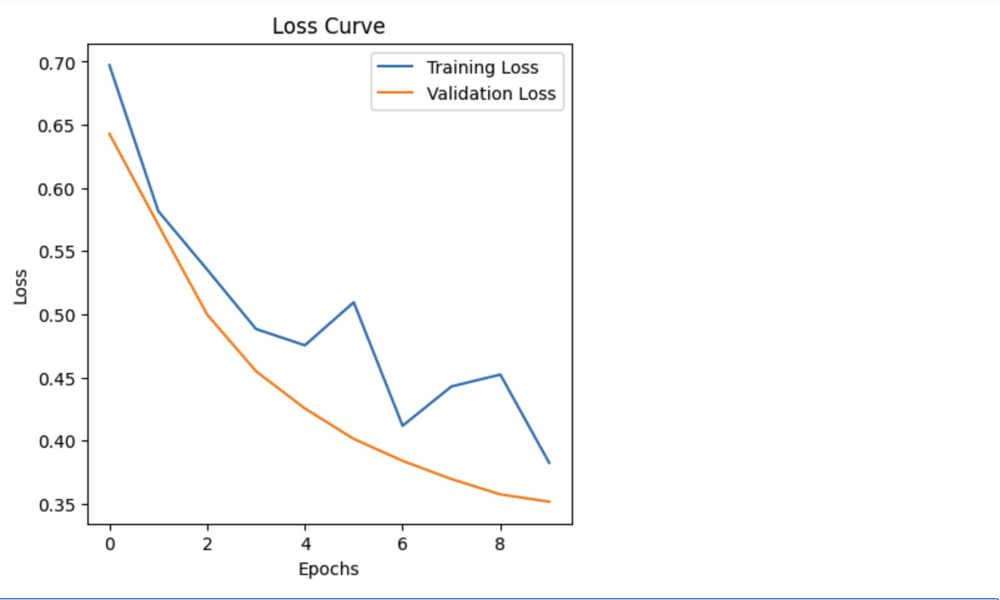
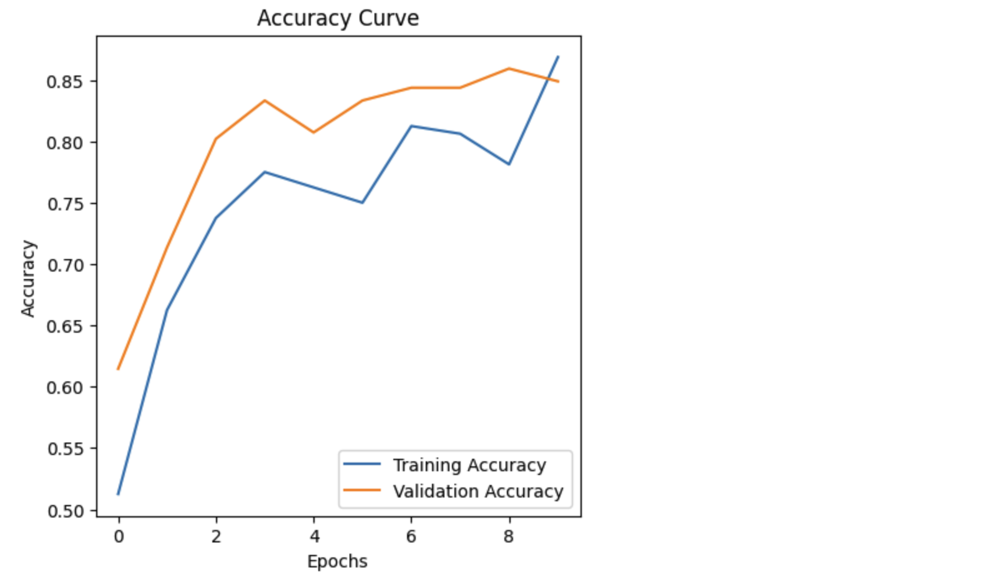
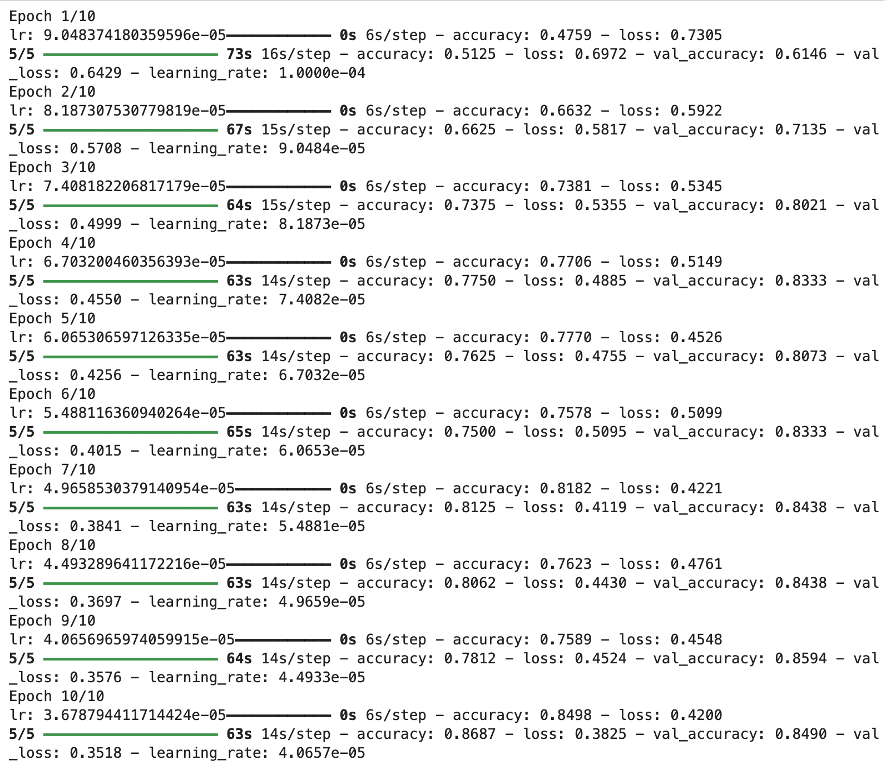
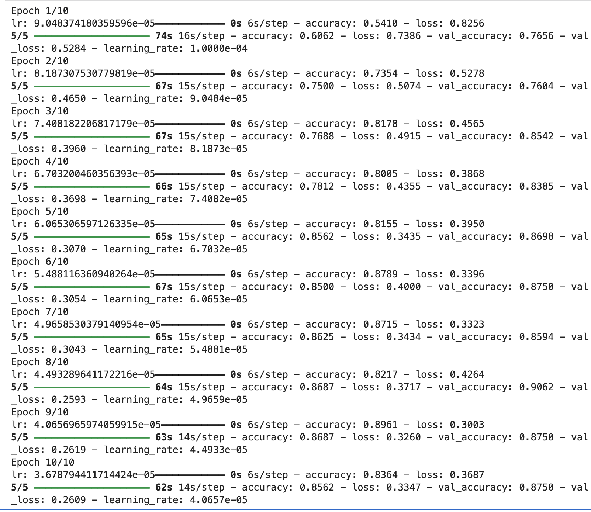
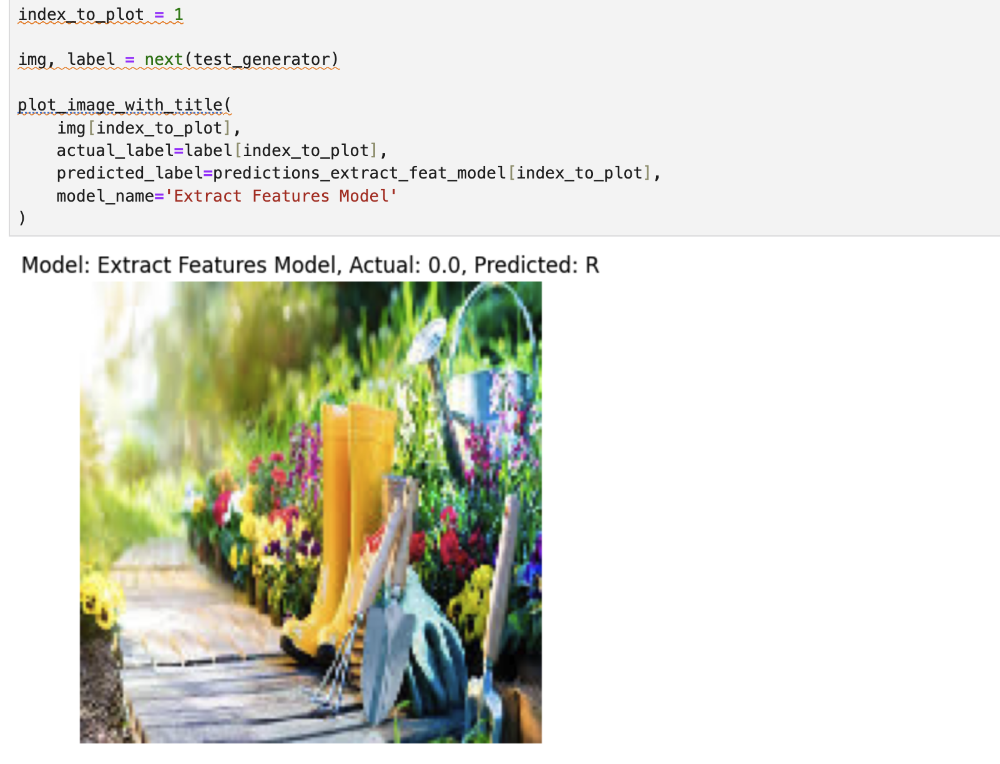
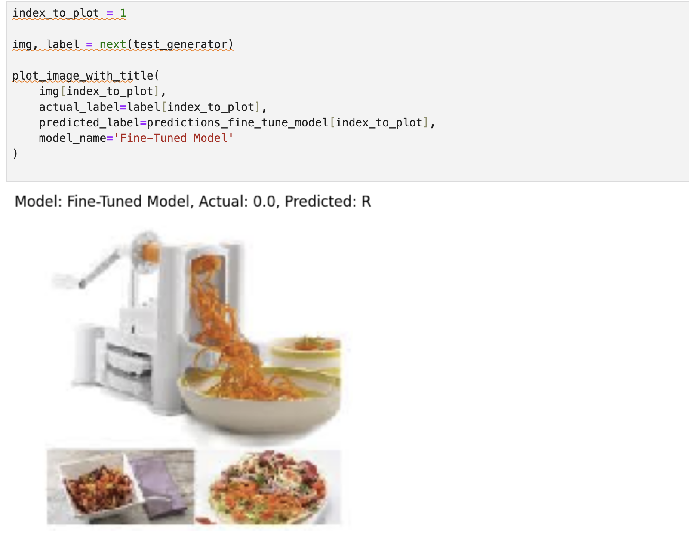

# Waste Classification using Transfer Learning

## Overview
This project uses deep learning and transfer learning to classify waste images into recyclable and organic categories using a pre-trained CNN model.

## What I did
- Used a pre-trained CNN for feature extraction
- Fine-tuned the model to improve performance
- Evaluated using accuracy, precision, recall, and F1-score
- Visualized predictions on test images

## Results
- Achieved ~90% accuracy
- Improved performance through fine-tuning vs feature extraction

## Real-World Impact

This model could be used in waste management systems to automatically classify recyclable vs non-recyclable materials, improving sorting efficiency and reducing human error.

Potential applications include:
- Smart recycling bins
- Waste sorting facilities
- Environmental sustainability initiatives

## Key Skills
- Transfer Learning
- Fine-Tuning Neural Networks
- Image Classification
- Model Evaluation
- TensorFlow / Keras

## Visual Results

### Training Performance

### Training Process

### Model Predictions

## How to Run This Project

1. Clone the repository  
2. Install dependencies (TensorFlow, NumPy, Matplotlib)  
3. Run the notebook: Final Proj-Classify Waste Products Using TL.ipynb  
